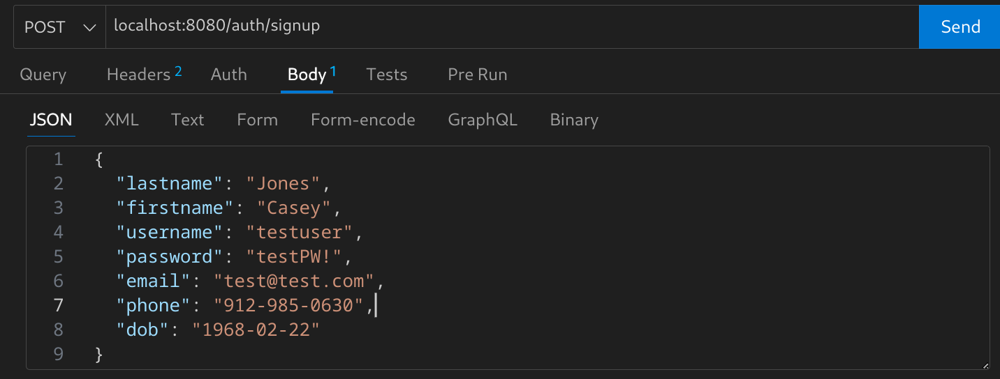
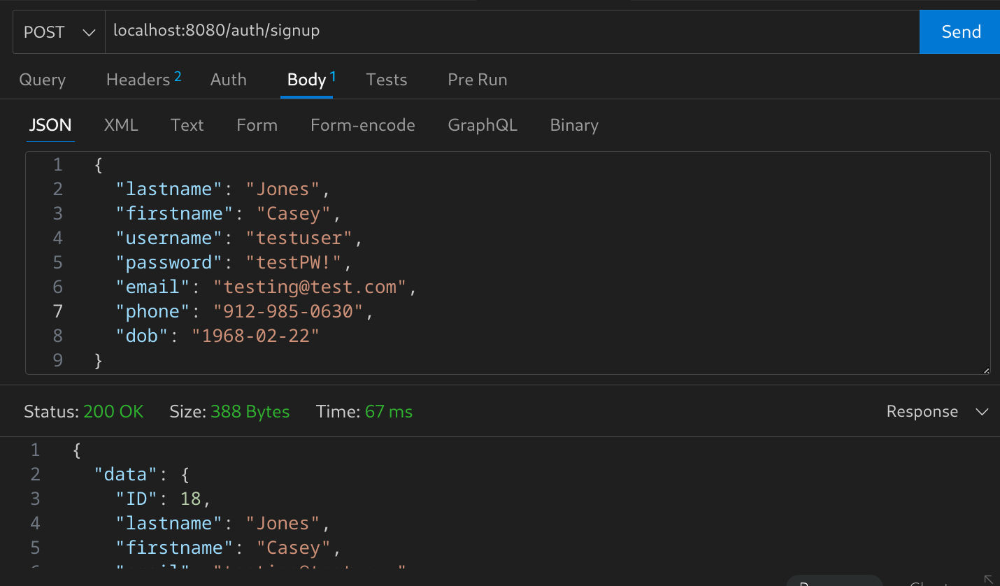
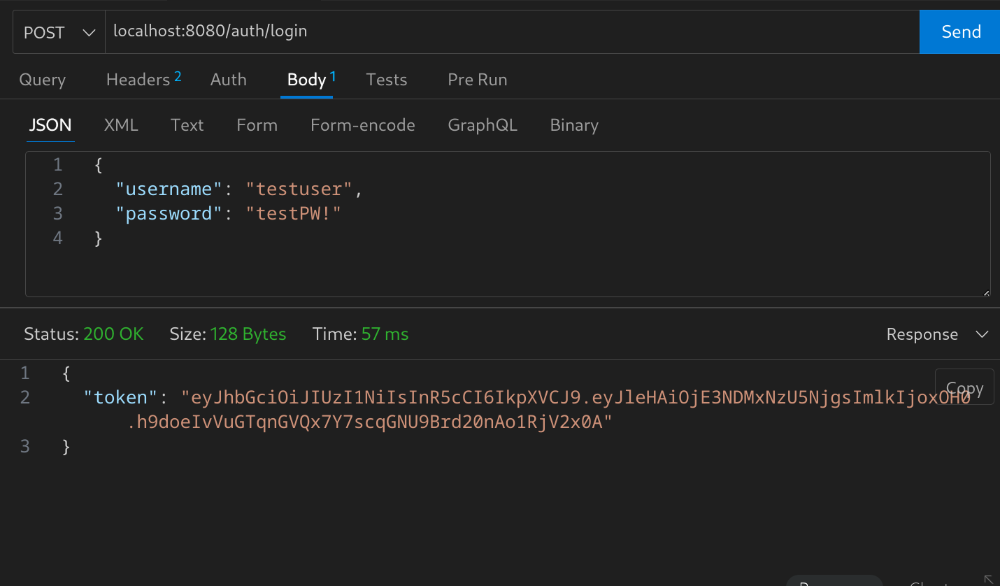
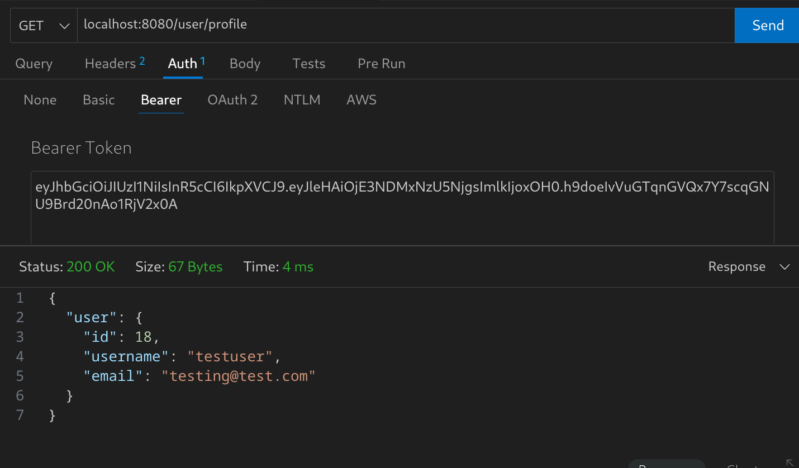

#### Here are some screenshots that show how it should look ( in this case using Thunder Client ) when a user signs up, logs in, and accesses a user only endpoint.

## Signup

## Sign up result

## Login

## User only endpoint

