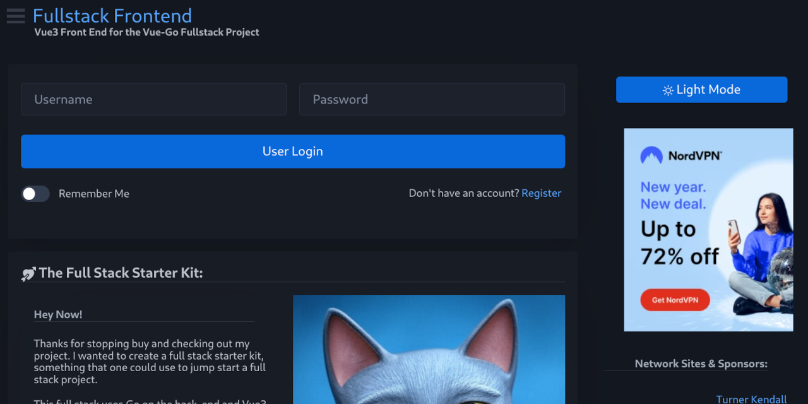

# vue-go-fullstack

😼 Hey Now!

This repository represents the combination of my previous gapi backend and gAuth Frontend repositories.  I decided to combine them as they became more and more dependent on each other.  Plus it gives a complete example of how I like to do :)

This is what I use as a starting point for new full stack projects.  It provides a working frontend and backend - with user auth, (postgres) database connection, etc.

If you want to run this yourself the first thing that you will want to do is rename the env file to .env and fill in the appropriate information for your database. There is a [README](/backend/README.md) file in the backend subdirectory that explains this in more depth as well as some tips for getting Postgres setup.  You can see how a user sign up / login should work [via these images.](API.md)

There is likewise a [README](/frontend/README.md) in the frontend directory that should help you get the Vue frontend running.

If you have any other questions, need some help getting this up and running, etc. feel free to reach out to me - tk@turnerkendall.com